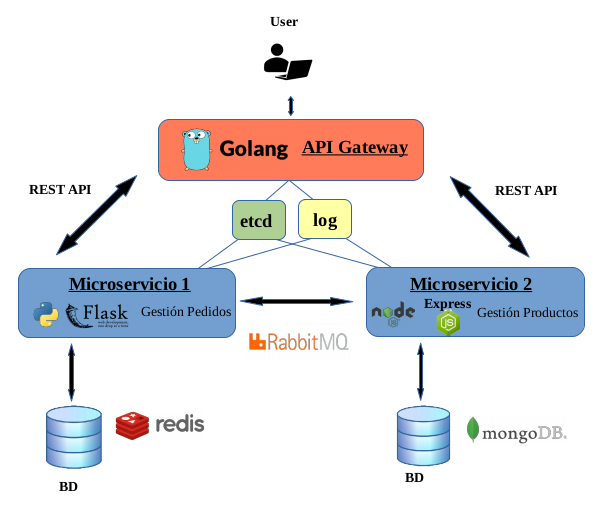

# CC-GestionPedidos

## Descripción

El proyecto consistirá en un gestor de productos y pedidos en el que el usuario podrá ver todos los productos que hay y realizar un pedido con la lista de productos y cantidades que desea.  

Consistirá en 2 microservicios con los que se podrá añadir, consultar, modificar y eliminar tanto los productos como los pedidos.

## Arquitectura

  

Se utilizará una arquitectura basada en microservicios en el que existirá un microservicio para gestionar los productos y otro microservicio para gestionar los pedidos.  

Los usuarios mandarán las peticiones a una **API Gateway** que será la encargada de ser el punto de entrada de las peticiones y redireccionarlas al microservicio correspondiente. Esta API Gateway será configurada con [Nginx](https://www.nginx.com/), ya que será fácil de configurar el redireccionamiento al microservicio correspondiente.

El **Microservicio 1** se encargará de gestionar los pedidos, de forma que se pueda crear un nuevo pedido, consultar los pedidos, borrarlos o modificarlos. Este microservicio será implementado en [Python](https://www.python.org/), ya que dispone de una gran cantidad de módulos disponibles y una comunidad muy grande que le da soporte. Como framework utilizaré [Flask](https://www.palletsprojects.com/p/flask/) por la sencillez y rapidez de implementación. Para almacenar la información usaré [PostgreSQL](https://www.postgresql.org/), que es una base de datos relacional y open-source.  

El **Microservicio 2** se encargará de gestionar los productos, de forma que se pueda crear un nuevo producto, consultarlos, modificarlos o borrarlos. Este microservicio será implementado en [Node.js](https://nodejs.org/es/), ya que tiene un gran rendimiento y tiene un gestor de paquetes, NPM (Node Package Manager) con la que se puede acceder a muchas librerías open-source. Como framework utilizaré [Express](https://expressjs.com/es/) ya que es uno de los frameworks más utilizados junto a Node.js. Para almacenar la información usaré [MongoDB](https://www.mongodb.com/es), que es una base de datos open-source orientada a documentos.

El microservicio 1 se comunicará con el microservicio 2 a través de su API REST. Por ejemplo, al realizar un pedido, se necesita saber si existen los productos que se indicaron y si hay stock suficiente, y el microservicio 2 le responderá con el resultado. De la misma forma, al realizar un pedido, el microservicio 1 le comunicará al microservicio 2 que tiene que reducir el stock de esos productos.

Habrá un **sistema de logs**  en el que se registrará todas las peticiones que se hagan. Para ello se centralizarán usando [Logstash](https://www.elastic.co/es/products/logstash), que es una de las herramientas open-source que más se está usando. Para enviar los logs utilizaré [python-logstash](https://pypi.org/project/python-logstash/) en Python y [node-logstash](https://www.npmjs.com/package/node-logstash) en Node.js, para enviar los logs generados en la API Gateway se realizará la configuración en Nginx.

También habrá un **sistema de configuración** en el que se almacenará los parámetros comunes de configuración. Para ello utilizaré [etcd](https://etcd.io/) por la facilidad de uso.

## Entidades e historias de uso

En el proyecto se va a trabajar con 2 entidades principales: Productos y Pedidos.

### Productos

Son los productos que podrán solicitar los usuarios. Cada producto contendrá:

- Código de producto.
- Nombre.
- Descripción.
- Precio.
- Stock.
- Categorías.

#### Historias de usuario asociadas a los Productos

[Issue 16: Consultar productos existentes](https://github.com/toniMR/CC-GestionPedidos/issues/16)  
[Issue 17: Consultar productos existentes que cumplan ciertas condiciones](https://github.com/toniMR/CC-GestionPedidos/issues/17)  
[Issue 18:  Añadir un nuevo producto](https://github.com/toniMR/CC-GestionPedidos/issues/18)  
[Issue 19: Modificar un producto](https://github.com/toniMR/CC-GestionPedidos/issues/19)  
[Issue 20: Eliminar un producto](https://github.com/toniMR/CC-GestionPedidos/issues/20)  

### Pedidos

Son los pedidos que realizarán  los usuarios. Cada pedido contendrá:

- Código de pedido.
- Nombre del destinatario.
- Dirección de envío.
- Lista de #Producto y unidades solicitadas.
- Estado del pedido (No procesado, Procesado, Entregando, Entregado)

#### Historias de usuario asociadas a los Pedidos

[Issue 21: Realizar un pedido](https://github.com/toniMR/CC-GestionPedidos/issues/21)  
[Issue 22: Modificar un pedido](https://github.com/toniMR/CC-GestionPedidos/issues/22)  
[Issue 23: Eliminar un pedido](https://github.com/toniMR/CC-GestionPedidos/issues/23)  
[Issue 24: Consultar un pedido](https://github.com/toniMR/CC-GestionPedidos/issues/24)  
[Issue 25: Consultar todos los pedidos](https://github.com/toniMR/CC-GestionPedidos/issues/25)  
[Issue 26: Consultar los pedidos con un estado determinado](https://github.com/toniMR/CC-GestionPedidos/issues/26)  
[Issue 27: Modificar el estado de un pedido](https://github.com/toniMR/CC-GestionPedidos/issues/27)  
