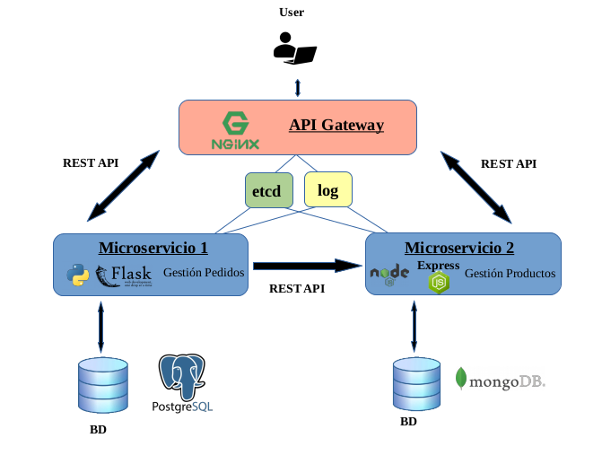

# CC-GestionPedidos

## Microservicio de Gestión de Pedidos

El microservicio permitirá gestionar pedidos. Cada pedido dispondrá de un número de pedido, el nombre del destinatario, la dirección de envío, los productos junto a las cantidades que se desean y el estado del pedido (No procesado, Procesado, Entregando, Entregado). Cada producto dispondrá de un identificador del producto, el nombre y la cantidad disponible.  

Se podrá añadir, consultar, modificar y eliminar tanto los productos como los pedidos.

### Arquitectura

  

Se utilizará una arquitectura basada en microservicios en el que existirá un microservicio para gestionar los productos y otro microservicio para gestionar los pedidos.  

Los usuarios mandarán las peticiones a una **API Gateway** que será la encargada de redireccionar las peticiones al microservicio correspondiente. Esta API Gateway será implementada con el lenguaje **Go**, ya que se conseguirá que la API sea concurrente de una forma sencilla.  

El **Microservicio 1** se encargará de gestionar los pedidos, de forma que se pueda crear un nuevo pedido, consultar los pedidos, borrarlos o modificarlos. Este microservicio será implementado en **Python** y como framework utilizaré **Flask** por la sencillez de implementación. Para almacenar la información usaré **PostgreSQL** por su gran rendimiento.  

El **Microservicio 2** se encargará de gestionar los productos, de forma que se pueda crear un nuevo producto, consultarlos, modificarlos o borrarlos. Este microservicio será implementado en **Node.js** y como framework utilizaré **Express**, ya que es uno de los frameworks más utilizados junto a Node.js.  

Como **broker de mensajería** usaré **RabbitMQ**, que permitirá la comunicación entre ambos microservicios.  

Además, habrá un **sistema de logs** en el que se registrará todas las peticiones que se hagan y un **sistema de configuración** en el que se almacenará los parámetros comunes de configuración.  
